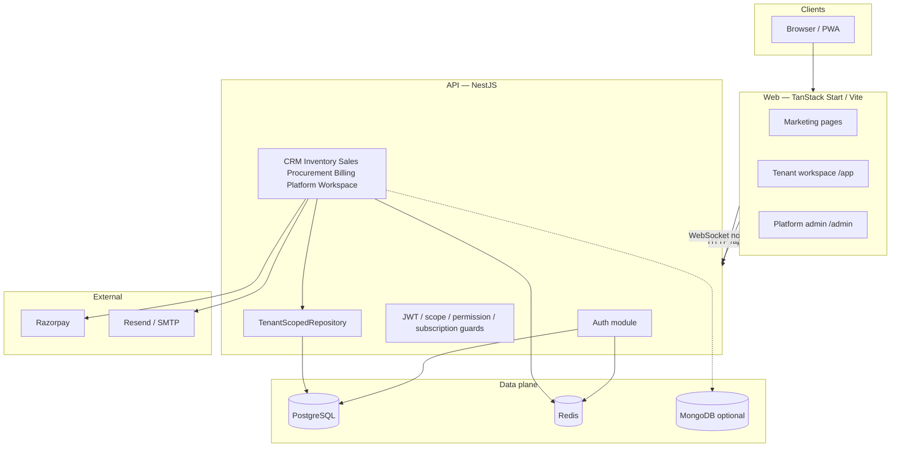

# System architecture

**Audience:** Engineers  
**Last updated:** July 2026

## High-level diagram

## Request flow (tenant API)

1. Client sends `Authorization: Bearer <accessToken>` to `/api/v1/...`.
2. `JwtAuthGuard` validates the token and attaches user claims (`sub`, `email`, `scope`, `role`, `tenantId`, `workspaceId`, `membershipId`).
3. Scope guards ensure platform routes only accept platform roles and tenant routes only accept tenant memberships.
4. `TenantContextInterceptor` / ALS (`tenant-context.storage`) sets the active `tenantId` for the request.
5. `PermissionGuard` / role decorators enforce fine-grained permissions from `@velon/shared`.
6. `SubscriptionGuard` (global) blocks workspace access when the subscription does not allow it (billing portal paths remain reachable).
7. Services use `TenantScopedRepository` so every Prisma query includes `tenantId` from context — **never from the request body**.

## API response envelope

Global interceptor and exception filter standardize success and error payloads for the web client.

## Real-time

NestJS WebSockets (`NotificationsModule` / gateway) push workspace notifications to connected clients (`socket.io-client` on the web).

## Related docs

- [Tech stack by category](./TECH-STACK.md)
- [Multi-tenancy](./MULTI-TENANCY.md)
- [Authentication](./AUTHENTICATION.md)
- [API reference](./API-REFERENCE.md)
