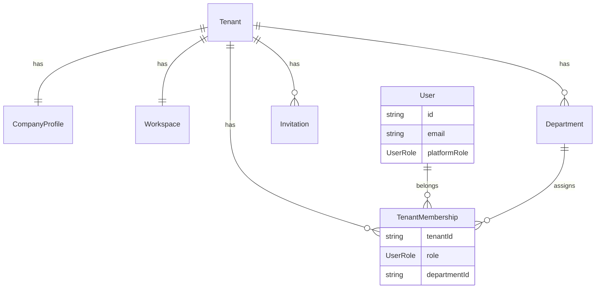
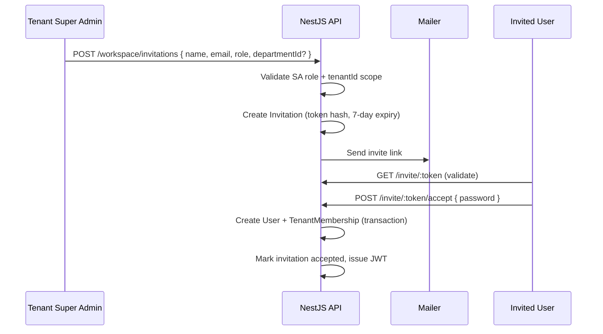

# Velon ERP — Phase 2 Tenant & Workspace Architecture Report

**Date:** June 7, 2026  
**Status:** Architecture definition — **implementation not started**  
**Prerequisite:** Phase 1 Platform Stabilization (complete)

---

## 1. Purpose

This document defines the **target enterprise tenant architecture** for Velon ERP before any Phase 2 code is written. It answers:

- Who owns a workspace
- Who can create a workspace
- User and role hierarchy
- Tenant isolation boundaries
- Platform vs workspace separation

**Development freeze continues** for CRM, ERP modules, HR, Inventory, Procurement, Finance, AI, Reporting, and Dashboard features until Phase 2 is implemented and verified.

---

## 2. Business Model & Terminology

| Term | Definition | Current codebase equivalent |
|------|------------|----------------------------|
| **Platform** | Velon ERP itself — operated by Velon staff | `/admin/*`, NestJS platform APIs |
| **Tenant** | A paying customer company (legal/billing entity) | `Tenant` model in Prisma |
| **Workspace** | The tenant's isolated ERP instance (operational environment) | **Not a distinct entity today** — conflated with `Tenant` + localStorage labels |
| **Company Profile** | Tenant's public/business identity (name, email, phone, country, industry) | Partially on `Tenant`; no dedicated profile model |
| **User** | A person who belongs to exactly one tenant (via membership) | `User` + `TenantMembership` |

### Canonical relationship (Phase 2 target)

```
Platform (Velon)
 └── Tenant (1 per customer company)
      ├── CompanyProfile (1:1)
      ├── Workspace (1:1 at launch; 1:N deferred)
      │    └── All ERP business records (scoped by tenantId)
      └── Users (N, via TenantMembership)
           └── optional Department assignment
```

**Launch decision:** **1 Tenant = 1 Workspace = 1 Company Profile.** Multi-workspace per tenant (e.g. subsidiaries) is deferred to Phase 3+.

---

## 3. Current State Assessment

### 3.1 What exists today

| Layer | Status |
|-------|--------|
| Postgres `User`, `Tenant`, `TenantMembership` | ✅ Schema exists |
| Transactional signup (user + tenant + membership) | ✅ Phase 1 fix |
| OTP-verified registration | ✅ |
| Platform admin UI (`/admin/*`, `/platform/login`) | ✅ Demo + API mode |
| Workspace UI (`/app/*`, `/login`) | ✅ Demo + API mode |
| `UserRole` enum (4 values) | ✅ Partial fit |
| `ROLE_PERMISSIONS` in `@velon/shared` | ✅ Defined, **not enforced** |
| JWT auth + refresh tokens | ✅ |
| `/owner/*` routes | ❌ Not implemented |

### 3.2 Critical gaps

| Gap | Impact | Evidence |
|-----|--------|----------|
| **No `tenantId` in JWT or session** | Cross-tenant data leakage risk once real data exists | `jwt.strategy.ts` returns `{ id, email, role }` only; `issueTokens()` omits `tenantId` |
| **Global `User.role` used for authorization** | User with multiple memberships cannot have per-tenant roles | `RolesGuard` checks `user.role`, ignores `TenantMembership.role` |
| **Workspace ERP data is not tenant-scoped** | All demo customers share one in-memory store | `erp-store.ts` — single `PlatformStore`; `getWorkspaceIdentity()` reads `tenants[0]` |
| **No Company Profile, Workspace, Department models** | Registration cannot capture required fields | Signup collects `businessName`, `email`, `password` only |
| **No invite system** | Users cannot join existing tenants | `users:invite` permission exists but no API/UI/backend |
| **Role naming collision** | `SUPER_ADMIN` means platform owner in code, but Phase 2 uses "Super Admin" for tenant owner | `UserRole.SUPER_ADMIN` vs "Tenant Super Admin" |
| **Platform/workspace UI mixed concepts** | Tenant switcher changes localStorage only; no data isolation | `workspace-user-profile.ts` — fake multi-tenant assignments |
| **No `/owner/*` portal** | Platform operators use `/admin/*` instead | Route tree has no owner routes |
| **No `/app/settings/admin`** | Tenant admin settings not separated | `/app/settings` is profile/regional only |

---

## 4. Target Role Hierarchy

### 4.1 Role definitions

| Phase 2 role | Scope | Can do | Cannot do |
|--------------|-------|--------|-----------|
| **Platform Owner** | Platform | View/suspend/activate tenants, manage subscriptions, platform analytics | Operate customer ERP records |
| **Tenant Super Admin** | Single tenant | Manage workspace, invite users, departments, roles, permissions, settings | Access other tenants; platform subscription controls |
| **Department Admin** | Department within tenant | Manage assigned department and its users | Change workspace/subscription settings |
| **Standard User** | Tenant | Access assigned modules only | Admin functions |

### 4.2 Proposed `UserRole` enum (breaking change)

Replace the current ambiguous enum with explicit platform vs tenant roles:

```prisma
enum UserRole {
  // Platform scope (Velon staff only)
  PLATFORM_OWNER
  PLATFORM_SUPPORT

  // Tenant scope (stored on TenantMembership, NOT global User.role)
  TENANT_SUPER_ADMIN
  DEPARTMENT_ADMIN
  TENANT_USER
}
```

**Migration mapping:**

| Current | Target |
|---------|--------|
| `SUPER_ADMIN` | `PLATFORM_OWNER` |
| `PLATFORM_SUPPORT` | `PLATFORM_SUPPORT` (unchanged) |
| `TENANT_ADMIN` | `TENANT_SUPER_ADMIN` (on membership) |
| `TENANT_USER` | `TENANT_USER` or `DEPARTMENT_ADMIN` (on membership) |

### 4.3 Authorization model

**Rule:** Platform roles live on `User.role`. Tenant roles live on `TenantMembership.role`. A user has at most one platform role OR one-or-more tenant memberships — never both platform + tenant roles on the same account (enforced at signup/invite).

**JWT payload (target):**

```typescript
type JwtPayload = {
  sub: string;           // userId
  email: string;
  scope: "platform" | "tenant";
  role: VelonRole;       // platform role OR active membership role
  tenantId?: string;     // required when scope === "tenant"
  membershipId?: string;
};
```

**Guards (target):**

| Guard | Purpose |
|-------|---------|
| `JwtAuthGuard` | Validates token |
| `PlatformScopeGuard` | `scope === "platform"` |
| `TenantScopeGuard` | `scope === "tenant"` + attaches `tenantId` to request |
| `RolesGuard` | Checks role against route metadata |
| `PermissionGuard` | Uses `ROLE_PERMISSIONS` + `roleHasPermission()` |

### 4.4 Permission matrix (enforced)

| Permission | Platform Owner | Platform Support | Tenant Super Admin | Dept Admin | Standard User |
|------------|:--------------:|:----------------:|:------------------:|:----------:|:-------------:|
| `platform:tenants:*` | ✅ | read/update | ❌ | ❌ | ❌ |
| `platform:subscriptions:*` | ✅ | read | ❌ | ❌ | ❌ |
| `workspace:settings` | ❌ | ❌ | ✅ | ❌ | ❌ |
| `workspace:users:invite` | ❌ | ❌ | ✅ | ❌ | ❌ |
| `workspace:users:manage` | ❌ | ❌ | ✅ | dept only | ❌ |
| `workspace:departments:*` | ❌ | ❌ | ✅ | read | ❌ |
| `workspace:modules:*` | ❌ | ❌ | ✅ | assigned | assigned |

---

## 5. Entity Model (Target Schema)

### 5.1 New and updated models

```prisma
model Tenant {
  id                String   @id @default(cuid())
  slug              String   @unique
  tenantCode        String   @unique
  status            TenantStatus @default(TRIAL)
  plan              TenantPlan   @default(STARTER)
  // billing/health fields retained from current schema
  companyProfile    CompanyProfile?
  workspace         Workspace?
  memberships       TenantMembership[]
  departments       Department[]
  invitations       Invitation[]
  // ...
}

model CompanyProfile {
  id          String  @id @default(cuid())
  tenantId    String  @unique
  legalName   String
  email       String
  phone       String
  country     String
  industry    IndustryTemplate
  tenant      Tenant  @relation(fields: [tenantId], references: [id], onDelete: Cascade)
}

model Workspace {
  id          String   @id @default(cuid())
  tenantId    String   @unique
  name        String
  slug        String   @unique
  isActive    Boolean  @default(true)
  createdAt   DateTime @default(now())
  tenant      Tenant   @relation(fields: [tenantId], references: [id], onDelete: Cascade)
}

model Department {
  id          String   @id @default(cuid())
  tenantId    String
  name        String
  slug        String
  tenant      Tenant   @relation(fields: [tenantId], references: [id], onDelete: Cascade)
  memberships TenantMembership[]
  @@unique([tenantId, slug])
}

model TenantMembership {
  id           String    @id @default(cuid())
  userId       String
  tenantId     String
  role         UserRole  // TENANT_SUPER_ADMIN | DEPARTMENT_ADMIN | TENANT_USER
  departmentId String?
  isActive     Boolean   @default(true)
  user         User      @relation(...)
  tenant       Tenant    @relation(...)
  department   Department? @relation(...)
  @@unique([userId, tenantId])
}

model Invitation {
  id           String    @id @default(cuid())
  tenantId     String
  email        String
  fullName     String
  role         UserRole  // TENANT_SUPER_ADMIN | DEPARTMENT_ADMIN | TENANT_USER
  departmentId String?
  tokenHash    String    @unique
  invitedById  String
  expiresAt    DateTime
  acceptedAt   DateTime?
  revokedAt    DateTime?
  tenant       Tenant    @relation(...)
  @@index([tenantId, email])
}
```

### 5.2 Business record scoping (all future ERP modules)

Every tenant-owned record **must** include:

```prisma
tenantId String
tenant   Tenant @relation(fields: [tenantId], references: [id], onDelete: Cascade)
@@index([tenantId])
```

**Query rule:** Every read/write appends `WHERE tenantId = :activeTenantId` from JWT. No exceptions. Platform APIs use explicit tenant ID in path (`/platform/tenants/:id`) — never bulk unscoped queries from tenant context.

### 5.3 Entity relationship diagram



---

## 6. Workspace Creation Flow (Target)

### 6.1 Registration fields

| Field | Required | Maps to |
|-------|----------|---------|
| Company Name | ✅ | `CompanyProfile.legalName`, `Workspace.name` |
| Company Email | ✅ | `CompanyProfile.email` |
| Company Phone | ✅ | `CompanyProfile.phone` |
| Country | ✅ | `CompanyProfile.country` |
| Industry | ✅ | `CompanyProfile.industry` |
| Full Name | ✅ | `User.name` |
| Password | ✅ | `User.passwordHash` |

OTP verification on company email remains (Phase 1).

### 6.2 Atomic creation sequence

All steps in a **single Postgres transaction**. Any failure rolls back everything.

```
1. Create Tenant          (status: TRIAL, plan: STARTER)
2. Create CompanyProfile  (1:1 with tenant)
3. Create Workspace       (1:1 with tenant, slug from company name)
4. Create User            (platformRole: null; name = Full Name)
5. Create TenantMembership (role: TENANT_SUPER_ADMIN)
6. Issue JWT              (scope: tenant, tenantId, role: TENANT_SUPER_ADMIN)
7. Send welcome email     (best-effort, outside transaction)
8. Audit log              (tenant.signup)
```

**First registered user = Tenant Super Admin.** No manual assignment.

### 6.3 Self-registration rules

| Action | Allowed |
|--------|---------|
| New company registers → new tenant + workspace | ✅ |
| Existing user self-registers into another company's workspace | ❌ |
| Invited user accepts invite → joins existing tenant | ✅ |

---

## 7. Invite User System (Target)

### 7.1 Flow



### 7.2 Invite constraints

- Only `TENANT_SUPER_ADMIN` can invite (Dept Admin cannot invite in v1)
- Invitee email must not belong to an active member of another tenant
- Token is single-use, hashed at rest
- Role assigned at invite time: `DEPARTMENT_ADMIN` or `TENANT_USER` (not Super Admin via invite in v1)

### 7.3 UI placement

- **Route:** `/app/settings/admin` → Team tab → Invite User dialog
- **Accept route:** `/invite/:token` (public, password set form)

---

## 8. Platform vs Workspace Separation

### 8.1 Route map (target)

| Portal | Login | App routes | Audience |
|--------|-------|------------|----------|
| **Platform (Owner)** | `/owner/login` | `/owner/dashboard`, `/owner/tenants`, `/owner/subscriptions`, … | Velon staff (`PLATFORM_OWNER`, `PLATFORM_SUPPORT`) |
| **Workspace (Tenant)** | `/login` | `/app/*` | Tenant users (`TENANT_*` roles) |

### 8.2 Migration from current routes

| Current | Target | Action |
|---------|--------|--------|
| `/platform/login` | `/owner/login` | Redirect alias (6-month deprecation) |
| `/admin/*` | `/owner/*` | Rename route tree + update guards |
| `/login` | `/login` | Keep — simplify copy ("Create Workspace" not "Sign Up") |
| `/app/settings` | `/app/settings` | Keep — profile/regional |
| — | `/app/settings/admin` | **New** — tenant admin (team, roles, departments) |

### 8.3 Separation rules

| Rule | Enforcement |
|------|-------------|
| Platform UI never shows ERP modules (inventory, CRM, etc.) | Route tree split |
| Workspace UI never shows tenant list, subscription management, platform analytics | Nav builder excludes platform links |
| Platform API never returns tenant business records | Separate controllers + guards |
| Workspace API always scoped by JWT `tenantId` | `TenantScopeGuard` + Prisma middleware |
| Session contexts remain separate (`velon.owner.*` vs `velon.app.*` localStorage keys) | Extend Phase 1 session scoping |

### 8.4 Session storage (target)

```
velon.owner.accessToken    — platform portal
velon.owner.refreshToken
velon.app.accessToken      — workspace portal
velon.app.refreshToken
velon.app.tenantId         — active tenant (NEW)
velon.app.workspaceId      — active workspace (NEW)
```

---

## 9. Login Experience (Target)

### Workspace login (`/login`)

**Show only:**

- Email
- Password
- Sign In
- Forgot Password (when reset flow exists; hide until implemented)
- Create Workspace (registration)

**Remove:**

- SSO buttons (already removed in Phase 1)
- MFA/SSO marketing claims until enforced
- Language/region selectors (move to post-login settings unless i18n is implemented)
- "Platform admin gateway" link → move to footer as subtle text link only

### Platform login (`/owner/login`)

- Email + Password only
- No registration (platform users are seeded or provisioned by Platform Owner)
- Link to workspace login for tenant users

---

## 10. Tenant Isolation Strategy

### 10.1 Defense in depth

| Layer | Mechanism |
|-------|-----------|
| **JWT** | `tenantId` required for tenant-scoped tokens |
| **API guards** | `TenantScopeGuard` rejects requests without valid tenant context |
| **Prisma middleware** | Auto-inject `tenantId` filter on all tenant-scoped models |
| **Database** | Row-level `tenantId` column + indexes on every business table |
| **Audit** | Log cross-tenant access attempts |
| **Tests** | Integration tests proving tenant A cannot read tenant B data |

### 10.2 Demo store migration path

The in-memory `erp-store.ts` **cannot support real isolation**. Phase 2 implementation must:

1. Introduce tenant-scoped data access layer (`TenantStore` interface)
2. Partition demo store by `tenantId` key (short-term dev bridge)
3. Migrate module-by-module to Postgres with `tenantId` (production path)

**Interim rule:** Disable demo multi-tenant switcher until backed by real scoped data.

---

## 11. Gap Analysis Summary

| Requirement | Current | Target | Priority |
|-------------|---------|--------|----------|
| Registration with 7 fields | 3 fields | 7 fields + OTP | P0 |
| Auto Tenant Super Admin | Sets `TENANT_ADMIN` globally | `TENANT_SUPER_ADMIN` on membership | P0 |
| Company Profile entity | None | `CompanyProfile` model | P0 |
| Workspace entity | localStorage string | `Workspace` model | P0 |
| tenantId in JWT/session | Missing | Required | P0 |
| Tenant-scoped queries | None | All business records | P0 |
| Invite users | UI toast only | Full API + email flow | P1 |
| Department Admin role | Missing | New enum + assignment | P1 |
| `/owner/*` portal | Missing | Replace `/admin/*` | P1 |
| `/app/settings/admin` | Missing | Team/roles/departments UI | P1 |
| Permission enforcement | Defined only | Guards on all routes | P1 |
| Platform/workspace separation | Partially mixed | Strict route + API split | P0 |
| Clean login UI | Partially cleaned | Remove placeholder copy | P2 |

---

## 12. Implementation Plan (Post-Approval)

Implementation begins **only after this report is approved**. Suggested order:

### Phase 2A — Schema & Auth Foundation (P0)

1. Prisma migration: `CompanyProfile`, `Workspace`, `Department`, `Invitation`; enum rename
2. Update signup API + UI for 7 registration fields
3. Transactional creation: Tenant → CompanyProfile → Workspace → User → Membership
4. JWT: add `scope`, `tenantId`, membership role
5. Guards: `PlatformScopeGuard`, `TenantScopeGuard`, wire `PermissionGuard`
6. Session: persist `tenantId` + `workspaceId` client-side

### Phase 2B — Portal Separation (P0)

7. Create `/owner/*` route tree (migrate from `/admin/*`)
8. Rename `/platform/login` → `/owner/login` with redirect
9. Separate session keys (`owner` vs `app`)
10. Clean workspace login page copy

### Phase 2C — Isolation Layer (P0)

11. Prisma tenant middleware (auto-filter by `tenantId`)
12. Refactor `erp-store` access to require `tenantId` parameter
13. Remove fake multi-tenant switcher from workspace profile
14. Integration tests for cross-tenant access denial

### Phase 2D — Team Management (P1)

15. Invitation API + email templates
16. `/invite/:token` accept flow
17. `/app/settings/admin` UI (invite, list users, assign roles)
18. Department CRUD (Super Admin only)

### Phase 2E — Verification (P0)

19. Execute success criteria checklist (Section 13)
20. Update `docs/PRODUCTION-ARCHITECTURE.md`

**Estimated scope:** ~25–35 files, 1 Prisma migration, no ERP module features.

---

## 13. Success Criteria Checklist

To be verified before Phase 2 is marked complete:

```
[ ] New company registration creates Tenant + Workspace + CompanyProfile + User in one transaction
[ ] First user is TENANT_SUPER_ADMIN on TenantMembership (not platform role)
[ ] Registration captures all 7 required fields
[ ] Tenant A user cannot access Tenant B data (API + UI)
[ ] JWT contains tenantId for workspace sessions
[ ] Super Admin can invite user by email + role
[ ] Invited user can set password and join workspace
[ ] Invited user cannot self-register into another tenant
[ ] Role hierarchy enforced (Super Admin > Dept Admin > Standard User)
[ ] Platform portal (/owner/*) shows no ERP business data
[ ] Workspace portal (/app/*) shows no platform management options
[ ] All new business records include tenantId
[ ] No manual database manipulation required for normal onboarding
[ ] Login pages show only implemented auth methods
```

---

## 14. Open Decisions (Require Product Sign-Off)

| # | Decision | Recommendation |
|---|----------|----------------|
| 1 | Rename `SUPER_ADMIN` → `PLATFORM_OWNER`? | Yes — eliminates naming collision with Tenant Super Admin |
| 2 | Keep `PLATFORM_SUPPORT` role? | Yes — for support staff with read-only tenant access |
| 3 | 1:1 Tenant:Workspace at launch? | Yes — defer multi-workspace |
| 4 | Migrate `/admin/*` → `/owner/*` or keep both? | Migrate with redirect aliases |
| 5 | Dept Admin can invite users in v1? | No — Super Admin only in v1 |
| 6 | Can one email belong to multiple tenants? | No in v1 — simplifies isolation |
| 7 | Demo mode: partition erp-store or disable multi-tenant demo? | Partition by tenantId key |
| 8 | Forgot password in Phase 2 scope? | Defer unless blocking — hide link until built |

---

## 15. Files Expected to Change (Implementation Reference)

| Area | Files |
|------|-------|
| Schema | `packages/database/prisma/schema.prisma`, new migration |
| Shared types | `packages/shared/src/index.ts` |
| Auth | `apps/api/src/auth/auth.service.ts`, `jwt.strategy.ts`, new guards |
| Tenants | `apps/api/src/tenants/*`, new `workspace/`, `invitations/` modules |
| Web routes | `src/routes/owner.*` (new), `src/routes/login.tsx`, `src/routes/app.settings.admin.tsx` (new) |
| Session | `src/lib/auth/session.ts`, `route-guard.ts` |
| Store | `src/erp/erp-store.ts`, `erp-functions.ts` |
| UI | `src/components/settings/*`, workspace shell nav |

---

## 16. Conclusion

Velon ERP has **foundational multi-tenant schema** from early development, but **runtime architecture still behaves as a single-tenant demo** with platform and workspace concepts interleaved. Phase 2 requires:

1. **Explicit entities** (CompanyProfile, Workspace, Department, Invitation)
2. **Clear role separation** (platform roles vs tenant membership roles)
3. **Mandatory tenantId** in JWT, session, and every query
4. **Distinct portals** (`/owner/*` vs `/app/*`)
5. **Invite-based team growth** (no cross-tenant self-registration)

This report is the implementation blueprint. **No Phase 2 code should be written until the open decisions in Section 14 are approved.**

---

*Next step: Review and approve this report, then begin Phase 2A (Schema & Auth Foundation).*
